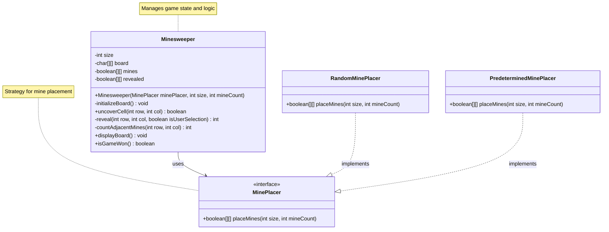

# Minesweeper Game
A classic Minesweeper game implementation in Java.

## Installation
### Prerequisites
Ensure you have the following installed:
- Operating System: Windows, macOS, or Linux
- [IntelliJ IDEA](https://www.jetbrains.com/idea/) (for IDE support)
- [Java JDK 8+](https://www.oracle.com/java/technologies/javase-downloads.html)
- [Maven](https://maven.apache.org/) (for dependency management)

### Mermaid Plugin Installation
To view the UML diagram in this README directly within IntelliJ IDEA:

1. Open IntelliJ IDEA
2. Go to Settings:
3. Navigate to Plugins
4. Search for "Mermaid"
5. Install the "Mermaid" plugin by JetBrains s.r.o
6. Restart IntelliJ IDEA when prompted
7. The Mermaid diagrams will now render in the Markdown preview

## Running the Game
### Using Command Line
To compile the code, run the following command :
```sh
javac -d out -sourcepath src/main/java src/main/java/Runner.java
```
To start the game, run the following command:
```sh
java -cp out Runner
```

### Using IntelliJ IDEA
1. Open the project in IntelliJ IDEA.

2. Right-click on the Runner.java file in the Project panel.

3. Select "Run 'Runner'" to run the program.

## Design Overview
### Game Rules
- The game board consists of a grid filled with hidden mines.
- The player selects a cell:
  - If it's a mine, the game is over.
  - If it's not a mine, the number of adjacent mines is revealed.
- The player wins when all non-mine cells are uncovered.

### Code Structure
```
minesweeper/
│── src/
│   ├── main/java/
│   │   ├── Runner.java                       # Entry point for the game
│   │   ├── Minesweeper.java                  # Core game logic
│   │   ├── services/
│   │   │   ├── MinePlacer.java               # Interface for mine placement
│   │   │   ├── RandomMinePlacer.java         # Implementation of random mine placement
│── ├── test/java/
│   │   ├── services/
│   │   │   ├── PredeterminedMinePlacer.java  # Implementation of predetermined mine placement for testing
│   │   ├── MinesweeperTest.java              # Unit tests for game logic
│   │   ├── MinesweeperEndToEndTest.java      # End-to-end tests for game flow                             
│── README.md                                 # Documentation
```

### Key Components
- **Runner.java**: Handles/Validates user input, starts the game loop, and interacts with the Minesweeper logic.
- **Minesweeper.java**: Implements the game mechanics, including board initialization, counting adjacent mines, checking if a cell contains a mine, and game status checks.
- **RandomMinePlacer.java**: Provides a strategy for randomly placing mines on the board.
- **MinePlacer.java**: Interface for mine placement strategies, allowing for extensibility.

### UML Class Diagram



## Running Tests
### Running Unit Tests
Unit tests validate the individual components of the game. You can run the unit tests directly within your IDE.
#### Using IntelliJ IDEA
1. Open the project in IntelliJ IDEA.

2. Navigate to the MinesweeperTest.java.

3. Right-click on the test class or method and select "Run".

### Running End-to-End Tests
End-to-end tests simulate a user playing the game to ensure the entire flow works as expected.
#### Using IntelliJ IDEA
1. Open the project in IntelliJ IDEA.

2. Navigate to the MinesweeperEndToEndTest.java file.

3. Right-click on the test class or method and select "Run".

## Generating Test Coverage
You can generate test coverage reports directly from IntelliJ IDEA using its built-in tools. To generate test coverage:
1. Open the project in IntelliJ IDEA.

2. Go to Run > Edit Configurations.

3. Select your test configuration (MinesweeperTest or MinesweeperEndToEndTest).

4. Under the Code Coverage section, select classes to include for coverage (Minesweeper).

5. Click OK to save the configuration.

Now, run the test configuration by clicking on 'Run with Coverage' under Run, and IntelliJ will generate a test coverage report.
